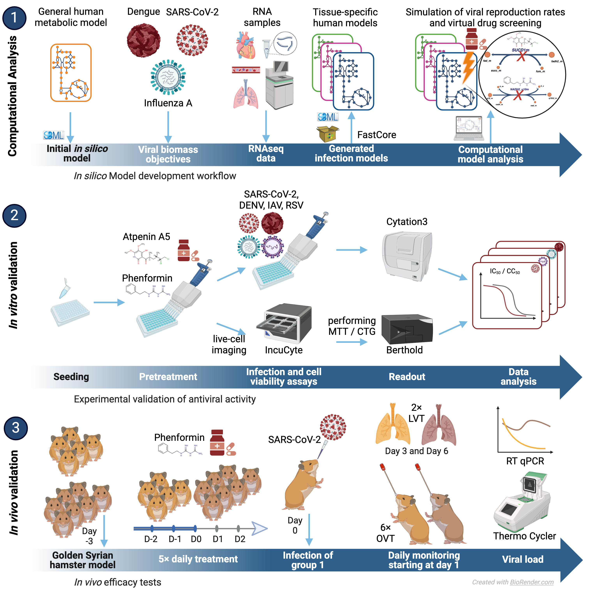

# R-DRUGS

**R-DRUGS: Rationalized Discovery of Robust Antiviral Targets Using Genome-scale Model Systems**

- The scripts are numbered according to their order of execution. 
- Influenza was used as an example. However, all other viruses were processed, evaluated, and analyzed in the same way. 
- For the CoreModels and CoreReactions, only a small subset of files were uploaded due to storage space reasons. The remaining files can be generated accordingly using the provided code. 
- The matlab models are uploaded as compressed files.
- The reconstructed models contain two sets of exchange reactions, one in the (e) compartment and one in the (u) compartment. The reactions occurring within the (u) compartment encompass cell types that interface with multiple environments simultaneously. However, these reactions do not impact our computational results as they only involve exchange reactions with a lower bound of zero, allowing only for compound outflow.

#### To convert hierarchical models defined with the Hierarchical Model Composition package into their "flattened" versions use the script within the `flatteningScript` directory. 
___________________________________________________________________________________________________________

### Licence and citation?
This project is licensed under the terms of the MIT license. 
The R-DRUGS pipeline is described in this article: https://doi.org/10.20944/preprints202210.0223.v2
